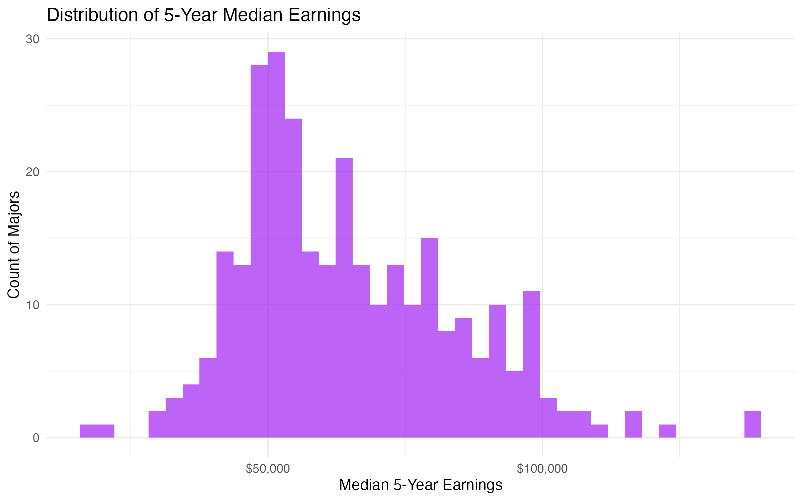
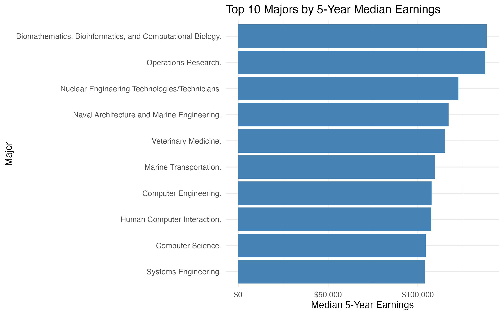
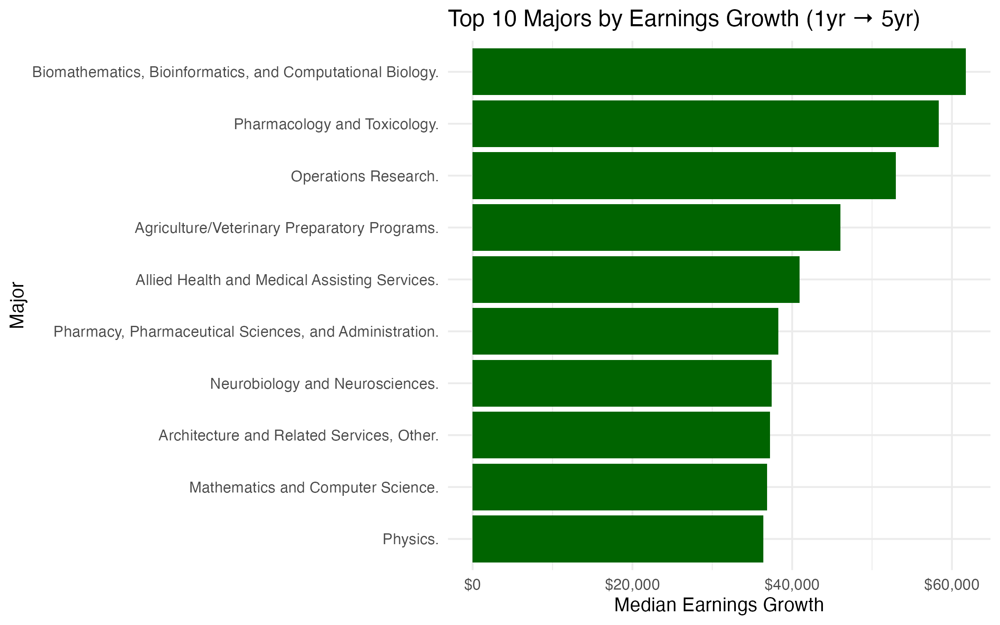
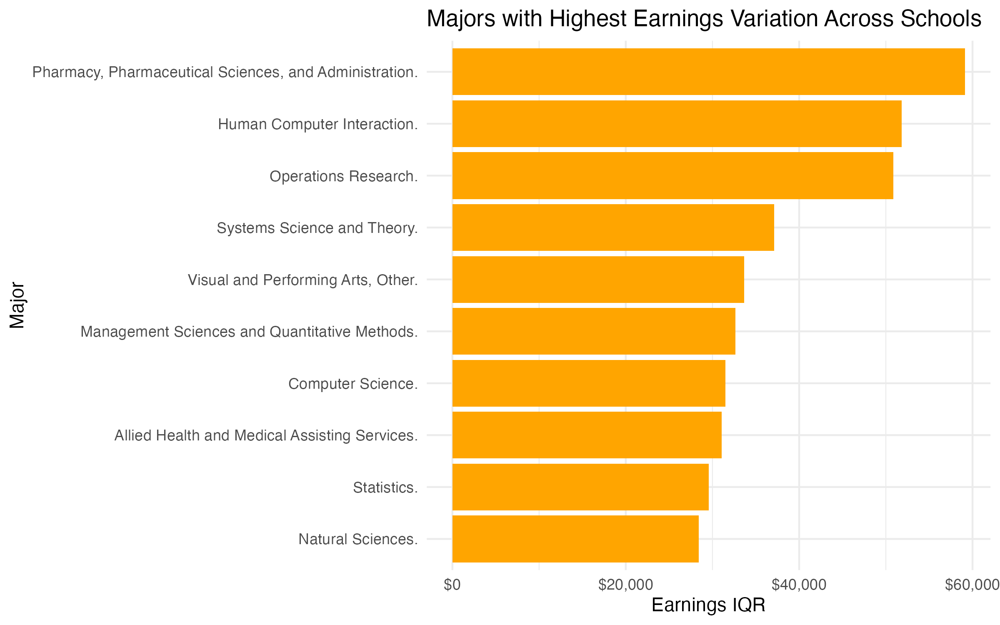
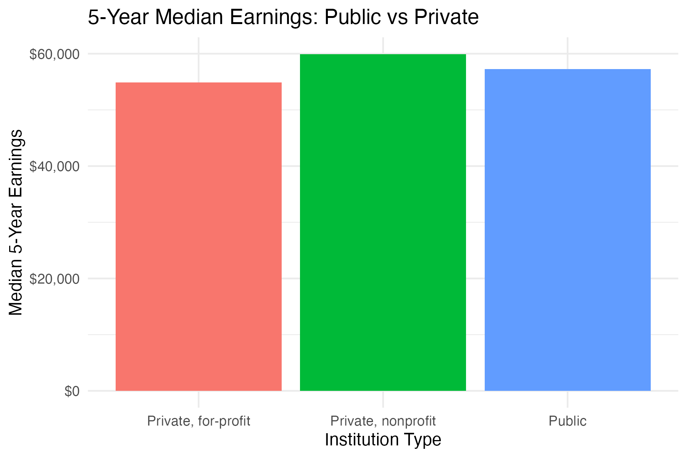

## Executive Summary

This project analyzes U.S. bachelor's programs using College Scorecard field-of-study data. The goal is to compare early-career and five-year earnings outcomes across majors, identify majors with strong earnings growth, and evaluate how much outcomes vary across institutions.

## Why This Project Matters

Students often choose majors based on perception rather than structured outcome data. This project applies a business analytics lens to compare majors using measurable earnings outcomes and variation across schools.

## Scope

- U.S. bachelor's programs only
- Main outcome: 5-year median earnings
- Additional metrics: 1-year earnings, earnings growth, earnings growth percentage, and variation across schools
- Additional cuts: Texas-only summary and public vs private comparison

## Methodology

The analysis uses the following derived measures:

- **Earnings 1 Year**: median earnings one year after program completion
- **Earnings 5 Years**: median earnings five years after program completion
- **Earnings Growth** = Earnings at 5 years - Earnings at 1 year
- **Earnings Growth %** = (Earnings 5yr - Earnings 1yr) / Earnings 1yr
- **Earnings Variation** = IQR of 5-year earnings across institutions for the same major

## Key Visuals

### Distribution of 5-Year Earnings

This distribution shows that major-level 5-year earnings are spread widely, with some majors clustered in moderate ranges and a smaller number of programs pulling far ahead.

### Top 10 Majors by 5-Year Earnings

These majors represent the strongest long-term earnings outcomes in the dataset and are useful for identifying fields with strong labor-market returns.

### Top 10 Majors by Earnings Growth

This view highlights majors that may not only earn well, but also accelerate meaningfully from year 1 to year 5.

### Majors with Highest Variation Across Schools

This result is especially important because it shows that school choice matters much more for some majors than for others.

### Public vs Private Comparison

This comparison helps evaluate whether institution type is associated with different 5-year earnings outcomes.

## Texas Spotlight

Texas-specific major summaries were created to add local relevance for Texas-based students and internship conversations. In the Texas subset, 80 majors had at least 3 institutions represented, making the state-level slice useful for directional comparison.

## Key Takeaways

- 5-year earnings provide a stronger signal than 1-year earnings for major comparison
- Some majors show strong long-term earnings but also high variation across schools
- Growth from year 1 to year 5 is an important lens because it captures trajectory, not just starting point
- State and institution-type cuts add useful context for interpreting major outcomes

## Limitations

- Debt variables were unavailable in usable form for bachelor's records in the selected file, so this project focuses on earnings outcomes rather than full ROI
- Some values are suppressed in the source data
- Institution name was used for a quick Texas slice, which is useful but not perfect
- Public earnings outcomes should not be interpreted causally without additional controls

## Conclusion

This project demonstrates how public education outcome data can be structured into a usable business analytics workflow: raw data ingestion, cleaning, metric design, grouped comparison, visualization, and reporting.